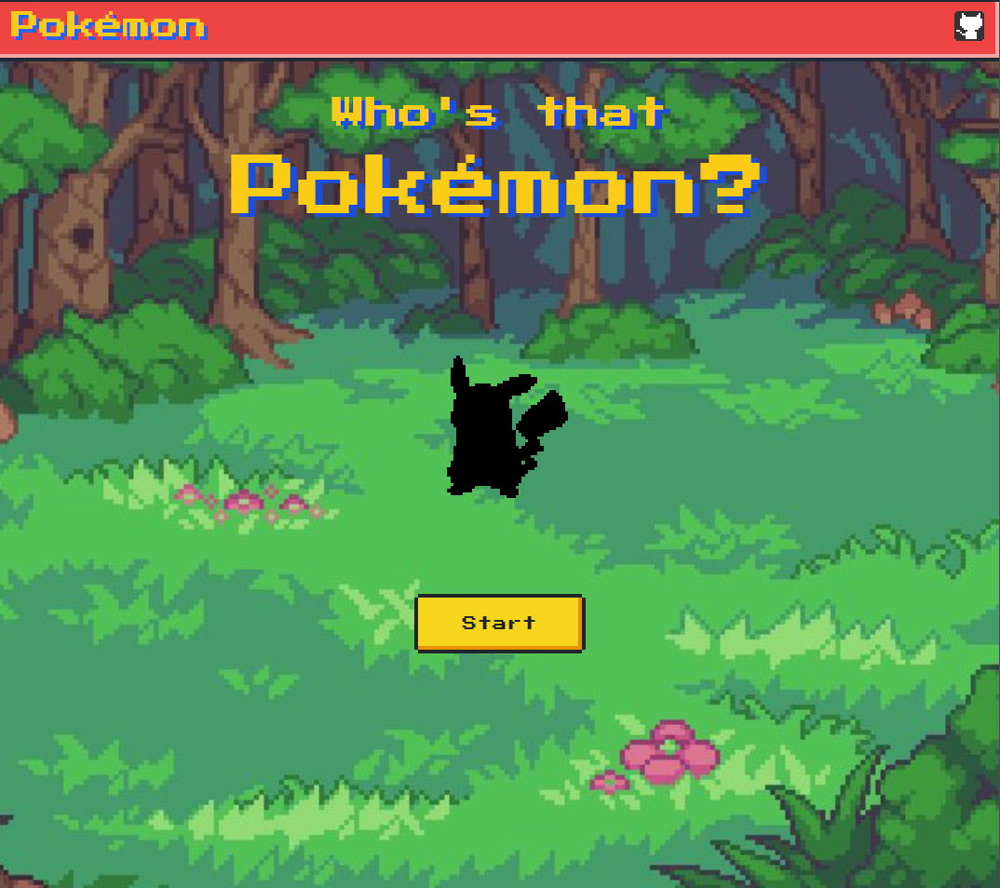

# Guess Pokemon

### Guess Pokemon Challenge de [Goncy](https://github.com/goncy/interview-challenges/tree/main/guess-pokemon)

# Tecnologías utilizadas

* Tailwind CSS
* Typescript
* React { React-Router-Dom, Context API }
* Vite

---

---

**[DEMO](https://guess-pokemon-app.vercel.app/)**